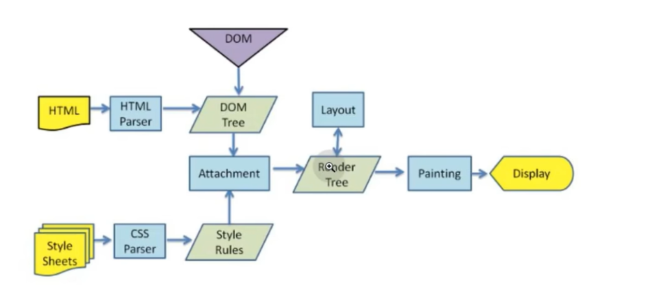

# Css基础

> Author: Sylvie233
>
> Date: 23/3/10

[TOC]

## 基础介绍

盒子模型

外边距、边框、内边距、内容

标准盒模型、IE盒模型（border-box）


CSS三大特性：继承性、层叠性、优先级


CSS继承性：

字体、文本、可见性、表格布局、列表、页面、声音


CSS优先级：

!important、行内样式、id、类/伪类/属性、标签、全局选择器


重排（布局引擎、几何属性、回流）、重绘（样式属性）




## 核心内容

```
Css3:
	align-itmes:
		center:
	background-color:
	bottom:
	box-sizing:
		border-box: IE盒模型
		content-box: 默认标准盒模型
	display:
		flex:
		grid:
		none:
	font-size:
	justify-content:
		center:
	line-height:
	margin:
		auto:
	opacity:
	padding:
	position:
		absolute:
		relative:
	right:
	top:
	transform:
		translate():
	visibility:
		hidden:
	width:
```


