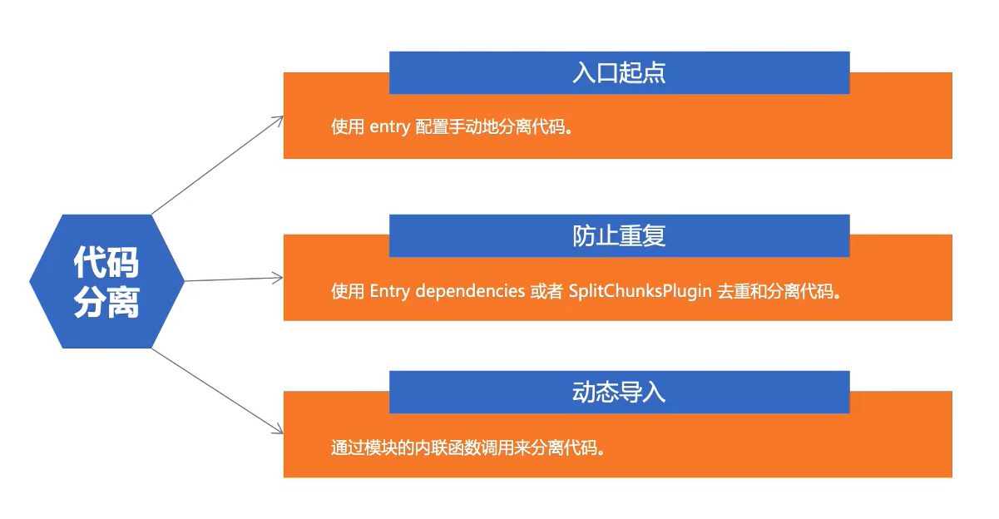

# Webpack5基础

Sylvie233的Webpack学习~~~

> Author: Sylvie233
>
> Date: 2022/10/16
>
> Point: P74

[TOC]


## 基础介绍

安装webpack

```
npm install webpack webpack-cli webpack-dev-server -D
```


默认入口：`src/index.js`


运行时

```
:
	__webpack_modules__:
	__webpack_require__(moduleId):
	__webpack_require(0): 运行入口模块
	__webpack_module_cache:
```


chunk

使用`import()`导入，加上`/* webpackChuunkName: 'xxx' */`指定chunk名


资源模块加载


环境配置：`webpack.config.[profile].js`

公共配置抽离


### webpack

```
webpack:
	-c: 指定配置文件
    -v:
	--config:
	--entry:
	--env:
	--help:
	--mode:
	--stats:
	--watch:

	detailed:
	serve:
```


### webpack-dev-server

```
webpack-dev-server:
	--open:
```


## 核心内容

webpack.config.js

```
const path = require("path")

const toml = require("toml")
const yaml = require("yaml")
const json5 = require("json5")

const HtmlWebpackPlugin = require("html-webpack-plugin")
const MiniCssExtractPlugin = require("mini-css-extract-plugin")
const CssMinimizerPlugin = require("css-minimizer-webpack-plugin")
const TerserWebpackPlugin = require("terser-webpack-plugin")
const { BundleAnalyzerPlugin } = require("webpack-bundle-analyzer")


module.exports = {
	entry: { // 可设置多入口
		index: "入口文件",
		main: ["xxx"],
		xxx入口名: {
			import: "xxx.js",
			dependOn: "shared共享", // 防止依赖多次重复打包
			filename: "xxx/[name].js",
		},
		shared共享: "公共库名"
	},
	output: {
		filename: "输出文件名|[name].[contenthash].bundle.js|",
		path: "输出路径 + path",
		publicPath: "/路径前缀",
		clean: true, // 清除旧打包文件
		assetModuleFilename: "images/[contenthash][ext]"
	},
	
	
	mode: "none", 	// development|
	devtool: "inline-source-map", /*
									inline-source-map:
									eval:
									hidden-source-map:
									
								  */
	devServer: {
		static: "./dist",
		compress: true,
		host: 0.0.0.0,
		port: 3000,
		headers: {
			"请求头": "xxx",
		},
		
		client: {
			overlay: true,
		},
		
		proxy: {
			"/api": {
				target: "/xxx",
			},
		},
		historyApiFallback: true,
		hot: true,
		liveReload: false,
		
		https: true|{
			cacert: "xxx.pem",
			pfx: "xxx.pfx",
			key: ".key",
			cert: "xxx.crt",
			passphrase: "webpack-dev-server",
			requestCert: true,
		},
		http2: true,
	},
	
	resolve: {
		alias: {
			"@": "路径别名",
		},
		extensions: [
			".ts",
			".json",
			".js",
		],
	},
	module: { // 模块加载
		rules: [
			{
				test: /\.png/,
				type: "asset/resource", /*
											asset/resource => url
											asset/inline   => dataUrl:base64
											asset/source   => 
											asset	       => 自动选择类型(两种)
										*/
				generator: {
					filename: ""
				},
				parser: {
					dataUrlCondition: {
						maxSize: 4 * 1024 * 1024, // 生成dataUrl的条件
					}
				},
			},
			{
				test: /\.ttf/,
                type: "asset/resource",
			},
			{
				test: /\.toml$/,
                type: "json",
                parser: {
                	parse: toml.parse
                },
			},
			{
				test: /\.js$/,
				exclude: "/node_modules",
				use: [{
                        loader: "babel-loader",
                        options: {
                            presets: [@babel/preset-env],
                            plugins: [
                                [
                                    "@babel/plugin-transform-runtime"
                                ]
                            ]
                        }
                    },
                    "eslint-loader"
				]
			},
			{
				test: /\.css/,
				use: [
					"style-loader",
					{
						loader: "css-loader",
						options: {
							modules: true,
						},
					},
					"postcss-loader",
				]
			},
			{
				test: /\.ts$/,
				use: [
					"ts-loader",
				],
				exclude: /node_modules/,
			},
			{
				test: /\.css/,
				use: [
					MiniCssExtractPlugin.loader,
					"css-loader",
				]
			},
			{
				test: /\.less/,
				use: [
					"style-loader",
					"css-loader",
					"less-loader"
				]
			},
		]
	},
	plugins: [	// 插件
		new HtmlWebpackPlugin({
			template: "自定义index.html模板",
			filename: "app.html", // 输出的模板文件名
			inject: "body", // <script>插入到<body>中
			chunks: [		// 指定使用的chunk
				"index",
				"main",
			],
			publicPath: "www.xxx.com",
			xxx: xxx值,
		}),
		new MiniCssExtractPlugin({
			filename: "styles/[contenthash].css",
		}),
		new BundleAnalyzerPlugin(),
	],
	
	externalsType: "script",
	externals: { // 外部模块
		jquery: [
            "jQuery"
		],
	},
	
	
	optimization: {
		minimizer: [
			new CssMinimizerPlugin(),
			new TerserWebpackPlugin(),
		],
		splitChunks: { // 代码分割
			chunks: all, // 
			cacheGroups: { // 缓存组
				vendor: {
					test: /node_modules/,
					name: "vendors",
					chunks: "all",
				}
			}
		},
		performance: {
			hints: false,
		},
	}
}

// 函数方式配置
module.exports = (env) => {
	const {
		WEBPACK_BUNDLE,
		WEBPACK_BUILD,
		production,
	} = env // 环境变量
	return {配置对象}
}
```


### Loader

#### css-loader

模块加载css文件


#### style-loader

生成`<style>`标签，内联


#### less-loader

模块加载less文件


#### csv-loader

#### xml-loader


#### babel-loader

js转换，兼容浏览器

```
npm i -D babel-loader @babel/core @babel/preset-env
npm i @babel/runtime @babel/plugin-transform-runtime
```


#### eslint-loader

es代码检查


#### postcss-loader

css兼容转换


#### ts-loader

ts文件加载


### 模块解析


### 代码分离




抽离公共代码，减小入口文件大小


动态导入：使用`import()`导入，加上`/* webpackChuunkName: 'xxx' */`指定chunk名


预加载

网络空闲时自动加载：`<link rel="prefetch" as="script">`


```
import(/*
	webpackChunkName: 'math',
	webpackPrefetch: true,
	webpackPreload: true,
*/ "xxx.js")
```


### 缓存

vendor chunk

缓存第三方库


### Source-map


默认eval


`.map`文件

```
{
	"version":,
	"file":,
	"mappings":,
	"sources": [],
	"sourcesContent": [],
	"names":,
	"sourceRoot":,
}
```


### Eslint


### Css模块

#### Postcss

```
npm i autoprefixer postcss-nested -D
```


`postcss.config.js`

```
module.exports = {
	plugins: [
		require("autoprefixer"),
		require("postcss-nested"),
	],
}
```


`package.json`

```
{
	"browserslist": [
		"> 1%",
		"last 2 versions", 
	]
}
```


### Web Worker

```
Worker:
	---
	onmessage:
	postMessage():
```


### Typescript

tsconfig.json

```
{
	"compilerOptions": {
		"outDir":,
		"noImplicitAny":,
		"sourceMap":,
		"module":,
		"target":,
		"jsx":,
		"allowJs":,
		"moduleResolution": "node",
	},
}
```


### 模块热替换

#### module

```
module:
	hot:
		accept():
```


### 第三方工具

#### webpack-merge

配置文件合并

webpack.config.js

```
const { merge } = require("webpack-merge")

const commonConfig = require("xxx")
const devConfig = require("xxx")
const prodConfig = require("xxx")

module.exports = (env) => {
	switch (true) {
		case env.development:
			return merge(commonConfig, devConfig)
		case env.production:
			return merge(commonConfig, prodConfig)
		default:
			return new Error("error config")
	}
}
```


#### husky

```
npm i husky
```


husky

```
husky:
	add:
		.husky/pre-commit:
	install:
```


`.husky目录`


## 常用插件

### css-minimizer-webpack-plugin

css文件压缩


### html-webpack-plugin

自动引入打包后的js文件


html模板使用（ejs模板语法）

```
<%= htmlWebpackPlugin.options.xxx自定义key %>
```


多个实例即可配置多页面应用


### mini-css-extract-plugin

合并css文件，link加载


### terser-webpack-plugin

js文件压缩


### webpack-bundle-analyzer

构建依赖图分析


