# JavaScript基础

> Author: Sylvie233
>
> Date: 23/3/10
>
> Point: 
>
> ​	WebRTC教程：P25

[TOC]

## 基础介绍

JS三大部分：ECMAScript（js基础语法）、DOM、BOM


垃圾回收机制


事件委托（事件冒泡机制）


数据类型

基本数据类型(栈、值)：String、Number、Boolean、undefined、null

引用数据类型(堆、地址)：Object、Function、Array、Date、RegExp


### 浏览器

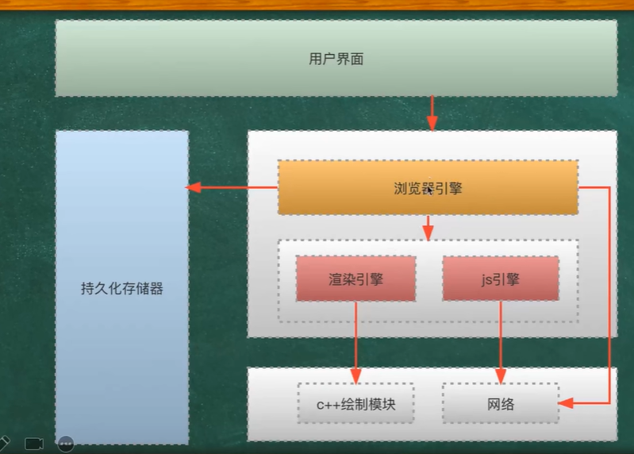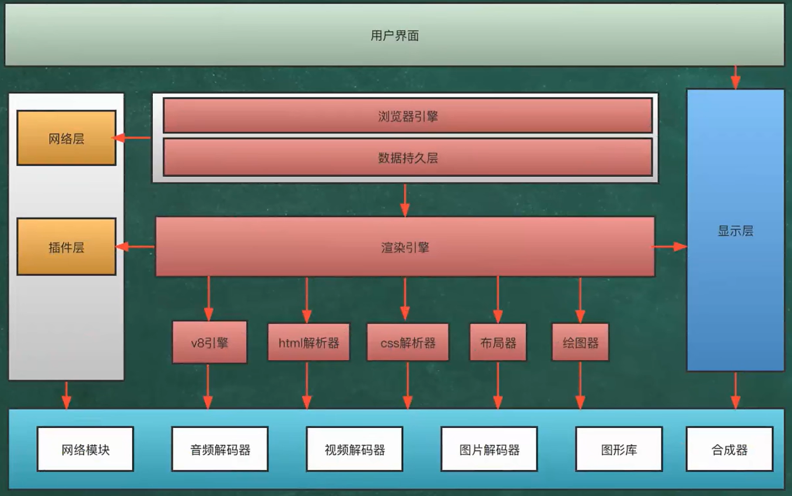


浏览器内核

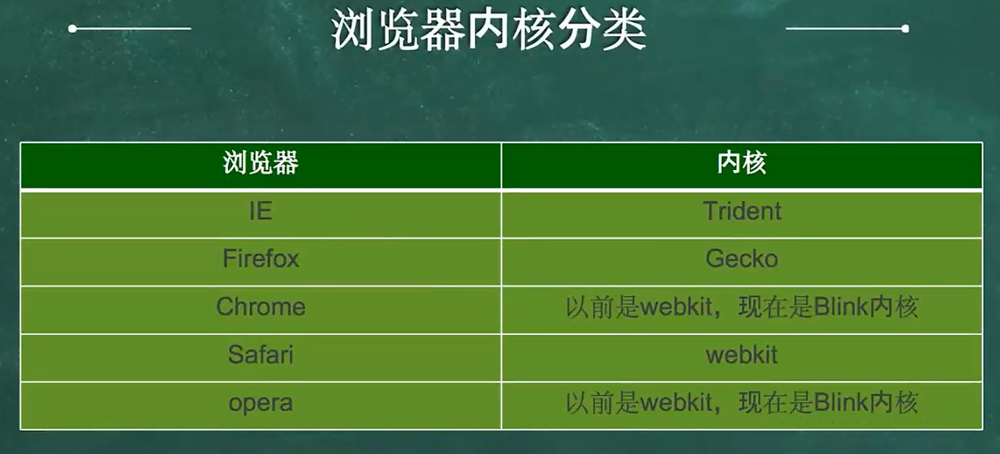


## 核心内容

### 原型链


### 闭包


### ES6新特性

const、let

async、await

Promise

Symbol、BigInt、Map/WeakMap、

Reflect、Proxy


### WebSocket


客服端请求协议升级

首先，客户端发起协议升级请求。可以看到，采用的是标准的HTTP报文格式，且只支持GET方法。

> GET / HTTP/1.1
> Host: localhost:8080
> Origin:http: //127.0.0.1:3000
> Connection: Upgrade
> Upgrade: websocket
> Sec-WebSocket-Version: 13
> Sec-WebSocket-Key: w4v7O6xFTi36lq3RNcgctw==

**重点请求首部意义如下：**

- Connection: Upgrade：表示要升级协议；
- Upgrade: websocket：表示要升级到websocket协议；
- Sec-WebSocket-Version: 13：表示websocket的版本。如果服务端不支持该版本，需要返回一个Sec-WebSocket-Versionheader，里面包含服务端支持的版本号；
- Sec-WebSocket-Key：与后面服务端响应首部的Sec-WebSocket-Accept是配套的，提供基本的防护，比如恶意的连接，或者无意的连接。


服务端响应协议升级

服务端返回内容如下，状态代码101表示协议切换。到此完成协议升级，后续的数据交互都按照新的协议来。

> HTTP/1.1 101 Switching Protocols
> Connection:Upgrade
> Upgrade: websocket
> Sec-WebSocket-Accept: Oy4NRAQ13jhfONC7bP8dTKb4PTU=

Sec-WebSocket-Accept根据客户端请求首部的Sec-WebSocket-Key计算出来。

**计算公式为：**

1）将Sec-WebSocket-Key跟258EAFA5-E914-47DA-95CA-C5AB0DC85B11拼接；

2）通过SHA1计算出摘要，并转成base64字符串。

**伪代码如下：**

> \> toBase64( sha1( Sec-WebSocket-Key + 258EAFA5-E914-47DA-95CA-C5AB0DC85B11 ) )


#### 数据帧

WebSocket客户端、服务端通信的最小单位是帧（frame），由1个或多个帧组成一条完整的消息（message）。

- 发送端：将消息切割成多个帧，并发送给服务端；
- 接收端：接收消息帧，并将关联的帧重新组装成完整的消息。

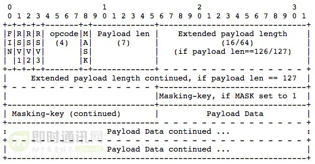

**1）FIN：1个比特。**

如果是1，表示这是消息（message）的最后一个分片（fragment），如果是0，表示不是是消息（message）的最后一个分片（fragment）。

**2）RSV1, RSV2, RSV3：各占1个比特。**

一般情况下全为0。当客户端、服务端协商采用WebSocket扩展时，这三个标志位可以非0，且值的含义由扩展进行定义。如果出现非零的值，且并没有采用WebSocket扩展，连接出错。

**3）Opcode：4个比特。**

操作代码，Opcode的值决定了应该如何解析后续的数据载荷（data payload）。如果操作代码是不认识的，那么接收端应该断开连接（fail the connection）。

**可选的操作代码如下：**

> %x0：表示一个延续帧。当Opcode为0时，表示本次数据传输采用了数据分片，当前收到的数据帧为其中一个数据分片。
> %x1：表示这是一个文本帧（frame）
> %x2：表示这是一个二进制帧（frame）
> %x3-7：保留的操作代码，用于后续定义的非控制帧。
> %x8：表示连接断开。
> %x9：表示这是一个ping操作。
> %xA：表示这是一个pong操作。
> %xB-F：保留的操作代码，用于后续定义的控制帧。

**4）Mask：1个比特。**

表示是否要对数据载荷进行掩码操作。从客户端向服务端发送数据时，需要对数据进行掩码操作；从服务端向客户端发送数据时，不需要对数据进行掩码操作。

如果服务端接收到的数据没有进行过掩码操作，服务端需要断开连接。

如果Mask是1，那么在Masking-key中会定义一个掩码键（masking key），并用这个掩码键来对数据载荷进行反掩码。所有客户端发送到服务端的数据帧，Mask都是1。

掩码的算法、用途在下一小节讲解。

**5）Payload length：数据载荷的长度，单位是字节。为7位，或7+16位，或1+64位。**

假设数Payload length === x，如果：

> x为0~126：数据的长度为x字节。
> x为126：后续2个字节代表一个16位的无符号整数，该无符号整数的值为数据的长度。
> x为127：后续8个字节代表一个64位的无符号整数（最高位为0），该无符号整数的值为数据的长度。

此外，如果payload length占用了多个字节的话，payload length的二进制表达采用网络序（big endian，重要的位在前）。

**6）Masking-key：0或4字节（32位）**

所有从客户端传送到服务端的数据帧，数据载荷都进行了掩码操作，Mask为1，且携带了4字节的Masking-key。如果Mask为0，则没有Masking-key。

备注：载荷数据的长度，不包括mask key的长度。

**7）Payload data：(x+y) 字节**

**载荷数据：**包括了扩展数据、应用数据。其中，扩展数据x字节，应用数据y字节。

**扩展数据：**如果没有协商使用扩展的话，扩展数据数据为0字节。所有的扩展都必须声明扩展数据的长度，或者可以如何计算出扩展数据的长度。此外，扩展如何使用必须在握手阶段就协商好。如果扩展数据存在，那么载荷数据长度必须将扩展数据的长度包含在内。

**应用数据：**任意的应用数据，在扩展数据之后（如果存在扩展数据），占据了数据帧剩余的位置。载荷数据长度 减去 扩展数据长度，就得到应用数据的长度。


#### 掩码算法

掩码键（Masking-key）是由客户端挑选出来的32位的随机数。掩码操作不会影响数据载荷的长度。

掩码、反掩码操作都采用如下算法。

**首先，假设：**

> original-octet-i：为原始数据的第i字节；
> transformed-octet-i：为转换后的数据的第i字节；
> j：为i mod 4的结果；
> masking-key-octet-j：为mask key第j字节。

**算法描述为：** original-octet-i 与 masking-key-octet-j 异或后，得到 transformed-octet-i。

> j = i MOD 4
> transformed-octet-i = original-octet-i XOR masking-key-octet-j


#### 数据分片

1）FIN=0，opcode=0x1，表示发送的是文本类型，且消息还没发送完成，还有后续的数据帧；

2）FIN=0，opcode=0x0，表示消息还没发送完成，还有后续的数据帧，当前的数据帧需要接在上一条数据帧之后；

3）FIN=1，opcode=0x0，表示消息已经发送完成，没有后续的数据帧，当前的数据帧需要接在上一条数据帧之后。服务端可以将关联的数据帧组装成完整的消息。

> Client: FIN=1, opcode=0x1, msg="hello"
> Server: (process complete message immediately) Hi.
> Client: FIN=0, opcode=0x1, msg="and a"
> Server: (listening, new message containing text started)
> Client: FIN=0, opcode=0x0, msg="happy new"
> Server: (listening, payload concatenated to previous message)
> Client: FIN=1, opcode=0x0, msg="year!"
> Server: (process complete message) Happy new year to you too!


#### 心跳机制

> 发送方->接收方：ping
> 接收方->发送方：pong

ping、pong的操作，对应的是WebSocket的两个控制帧，opcode分别是0x9、0xA。

**举例：**WebSocket服务端向客户端发送ping，只需要如下代码（采用ws模块）

> ws.ping('', false, true);


### WebRTC

媒体协商、网络协商

交换offer/answer(SDP)、交换网络信息candidate、建立连接（传输数据）

- ICE服务器（Coturn）：处理ice请求，candidate选择（实现STUN、TURN）

- 信令服务器（WebSocket|自定义）：用于辅助其它业务（交换信息）


建立连接后从RTCPeerConnection中获取流数据


有新的人加入就重新设置会话，重新与新加入的人建立新会话 ，一个RTC对象只能与一个远端连接 


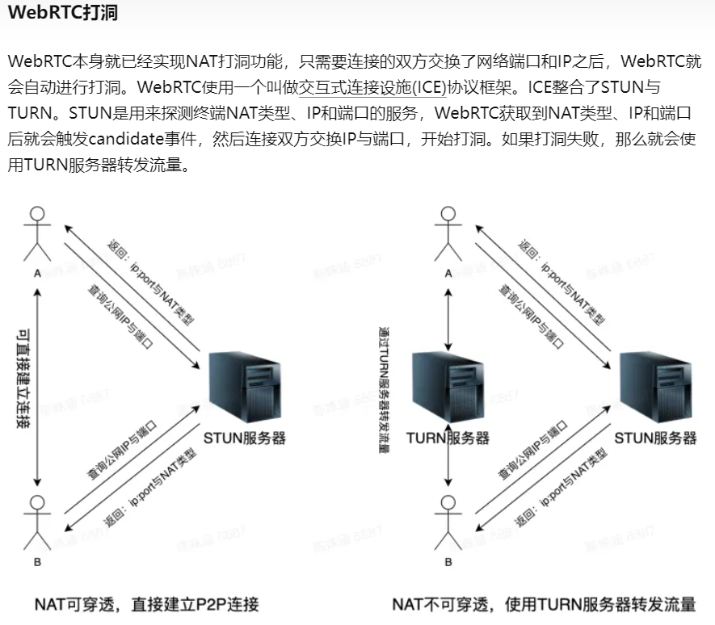

由于WebRTC提供了ICE，所以使用非常简单，只需在`new RTCPeerConnection`时传入`iceServers`参数即可。googel提供了免费的STUN服务器去帮助打洞，也可以自己架设服务器。

```js
 const pc = new RTCPeerConnection({ 
  // 可以传入多个stun服务器或者turn服务器 
  iceServers: [ 
    { url: 'stun:stun.l.google.com:19302' }, 
    { url: 'stun:stun1.l.google.com:19302' }, 
    { url: 'stun:stun2.l.google.com:19302' }, 
    { url: 'stun:stun3.l.google.com:19302' }, 
    { url: 'stun:stun4.l.google.com:19302' } 
  ] 
}) 
```


媒体协商SDP协议，通信双方交换SDP信息


WebRTC连接需进行offer与answer的交换，至少需进行4次通信。分别为：发送`offer/answer`，接收`answer/offer`，发送网络信息，接收对方网络信息

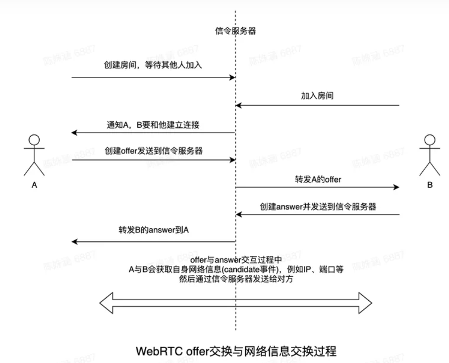

WebRTC交换offer与网络参数之后，就会尝试直接使用对方的IP地址与端口进行直接连接，这个过程中会根据双方网络情况，使用的不同的方式建立连接


局域网NAT

网络协商candidate：描述网络信息


MediaStream、RTCPeerConnection


coturn穿透、转发服务器


信令设计、媒体协商、假如Stream/Track、网络协商


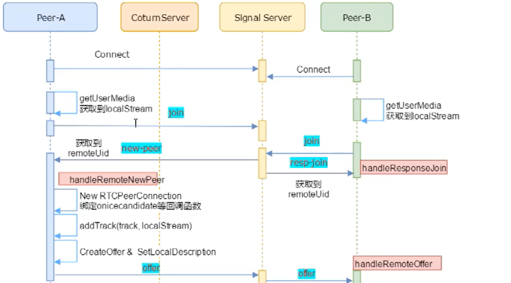

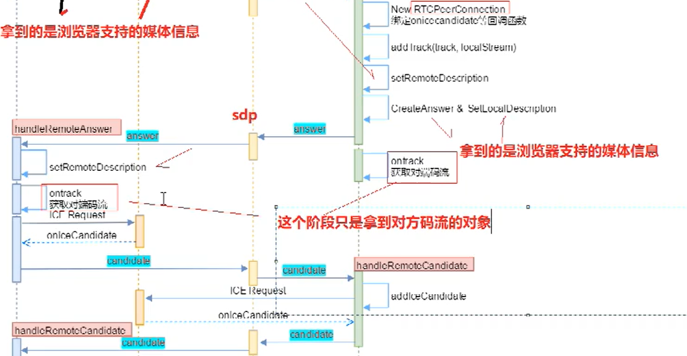

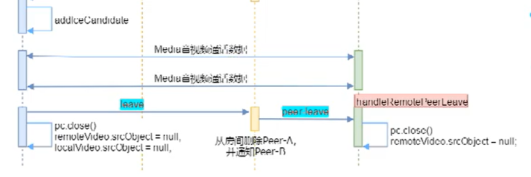


#### 信令服务器

A与B在建立连接的WebRTC连接过程中，需要互相知道对方的IP与通信端口。那么A与B要如何知道对方的IP与端口呢？答案就是通过信令服务器。
信令服务器的作用是作为一个中间人帮助双方在尽可能少的暴露隐私的情况下建立连接。WebRTC并没有提供信令传递机制，你可以使用任何方式如WebSocket 或者XMLHttpRequest 等，来交换彼此的令牌信息。


Signal Server

媒体协商、网络协商数据的交换通道：sdp、condidate

房间管理、


- 服务端使用socket.io(WebSocket)来作为信令服务器来转发客户端数据。其主要功能包括房间创建分配与客户端数据转发。
- 


##### STUN

Session Traversal Utilities for NAT，NAT会话穿越应用程序协议，允许位于NAT后的客户端找出自己的公网地址（IP、PORT）


##### TURN

Traversal Using Relays around NAT，即使用中继穿透NAT，STUN服务中继

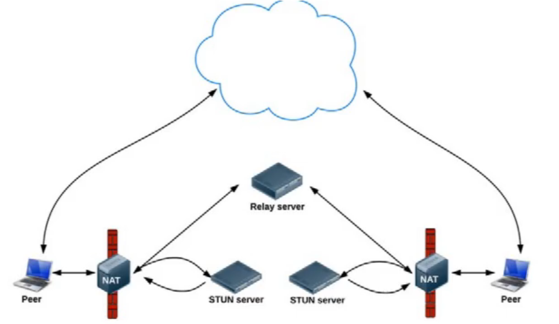


##### ICE

Interactive Connectivity Establishment，即交互式连接建立

ICE会同时使用STUN和TURN，它通过这两个技术获得IP地址和端口（被称为candidate）

ICE的工作步骤：

1. 搜集地址：通话前先搜集本地的IP和端口号（canidate），然后拿这些candiate和STUN server通信，得到可用的candidate以及对应的公网IP和端口号。然后再访问TURN server得到所有中继candidate以及公网IP和端口。通过上述的步骤，可以得到这个candiate是哪个网卡的，是否存在NAT，可以得到是否是relay。搜集到candidate后需要给这些candidate分配优先级。通常来说，中继candidate优先级最低。如果存在多张网卡，也会有一些偏好，如VPN优先级会高一点。拿到这些地址后，就可以填充到SIP消息中，ICE扩展了SDP，增加了新的candidate属性，列出了所有candiate的IP、端口、优先级、类型。
2. 检查连接：主叫和被叫已经交换了SDP，拿到对方candidate后，使用这些地址发送STUN消息检查连接。比如被叫选择自己的一个candidate和主叫的candidate，利用这个连接发送一条STUN消息给主叫，主叫收到后恢复STUN消息表明自己已经收到，如果被叫能够收到这条消息，那么被叫就能发送报文到主叫了。此时，这样一来一回地通信可以检查，主叫和被叫在这个连接中是双向互通的。这里STUN消息和媒体流使用相同的IP和端口，也就意味着这个IP和端口需要复用。
3. 完成：检查完成后，客户端会拿第一个完成的candidate用于通信，第一个完成的通常也是优先级最高的。最终，客户端会完成最后一次确认，确认这个candidate对是最终选择的，后续的通信会使用这个candidate对，不会有任何不明确。


##### NAT

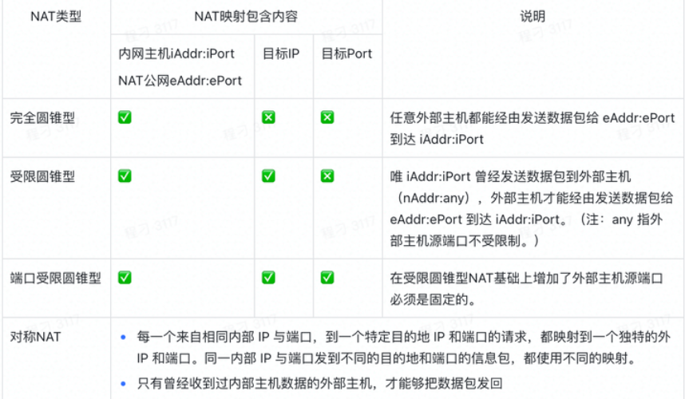


NAT打洞


##### SDP

SDP并不是一个真正的协议，而是一种数据格式，用于描述在设备之间共享媒体的连接。SDP由一行或多行UTF-8文本组成，每行以一个字符的类型开头，后跟等号(=)，然后是包含值或描述的结构化文本，其格式取决于类型。如下为一个SDP内容示例：

```text
   v=0
   o=alice 2890844526 2890844526 IN IP4 host.anywhere.com
   s=
   c=IN IP4 host.anywhere.com
   t=0 0
   m=audio 49170 RTP/AVP 0
   a=rtpmap:0 PCMU/8000
   m=video 51372 RTP/AVP 31
   a=rtpmap:31 H261/90000
   m=video 53000 RTP/AVP 32
   a=rtpmap:32 MPV/90000
```

SDP主要描述了彼此的音视频编解码能力、网络带宽和传输协议等信息。WebRTC中的SDP常用字段：

- Version(v)：协议版本
- Origion(o)：会话发起者
- Session Name(s)：会话名
- Connection Data(c)：连接数据
- Media Announcements(m)：媒体描述


##### candidate

当`RTCPeerConnection`实例执行`setLocalDescription()`后，`RTCPeerConnection`就会探测自己的网络环境，然后用candidate事件会返回候选网络环境数据，网络环境数据中最重要的是IP地址与端口组成的候选通信地址。
candidate事件中的event.candidate主要包含以下几个部分：

- 本机 IP 地址
- 本机用于WebRTC通信的端口号
- 候选者类型，包括 host、srflx 和 relay
- 优先级
- 传输协议

```json
 { 
  "address": "192.168.31.67", 
  "candidate": "candidate:2147606101 1 udp 2122260223 192.168.31.67 57959 typ host generation 0 ufrag EaWw network-id 1 network-cost 10", 
  "component": "rtp", 
  "foundation": "2147606101", 
  "port": 57959, 
  "priority": 2122260223, 
  "protocol": "udp", 
  "relatedAddress": null, 
  "relatedPort": null, 
  "sdpMLineIndex": 0, 
  "sdpMid": "0", 
  "tcpType": null, 
  "type": "host", 
  "usernameFragment": "EaWw" 
} 
```

candidate事件type字段取值分别为host、srflx、relay：

- **host(Host candidate)：**从本地网卡上获取的地址
- **srflx(Server reflexive candidate)：**STUN 返回的该客户端的地址
- **relay(Relay reflexive candidate):：**TURN 服务器为该客户端分配的中继地址

本地的candidate与远端candidate构成的每一对都有一定的优先级，按优先级排序进行连通性检查。最后从有效的candidate组合中选择优先级最高的作为传输地址，用于建立P2P连接。


## API

```
:
	instanceof: 引用数据类型
	typeof: 基本数据类型、object 
	parseInt():
	---
	Array:
		from():
		isArray():
		---
		concat():
		flat():
		includes():
		join():
		pop():
		push():
		reverse():
		shift():
		sort():
		splice():
		unshift():
	BigInt:
	Boolean:
	Date:
		---
		getYear():
	Document:
		---
		addEventListener():
	Event:
		---
		currentTarget:
		target:
		stopPropagation():
	Function:
		call():
	HTMLAudioElement:
	HTMLDivElement:
		
	HTMLVideoElement:
		srcObject:
	Map:
	Math:
		abs():
		random():
		sqrt():
		max():
	MediaStream:
	Navigator:
		mediaDevices: 媒体设备
			getUserMedia():
				audio:
				video:
				---
	Number:
		MAX_SAFE_INTEGER: 2^53-1
		IsInteger:
		---
	Object:
		prototype:
			toString():
		assign():
		entries():
		keys():
		---
	Promise:
		all():
		any():
		race():
		reject():
		resolve():
		---
		catch():
		then():
	Proxy:
	Reflect:
	RegExp:
	RTCPeerConnection:
		---
		addEventListener():
			datachannel: 数据通道接收消息
				event:
					channel: 创建的数据通道
						addEventListener():
							message: 数据通道收到消息
			icecandidate: 获取本地网络信息，并发送给通信方（利用WebSocket）
			track: 有远程视频流时，显示远程视频流 
		addIceCandidate(): 添加网络信息
		addTrack(): 添加流数据到会话中
		close(): 关闭连接
		createAnswer():
		createDataChannel(): 创建数据通道
			---
			addEventListener():
				open:
				close:
			send(): 发送消息
		createOffer():
		setLocalDescription(): 设置本地SDP
		setRemoteDescription(): 设置远程SDP
	Set:
	String:
		---
	Symbol:
	WeakMap:
```

